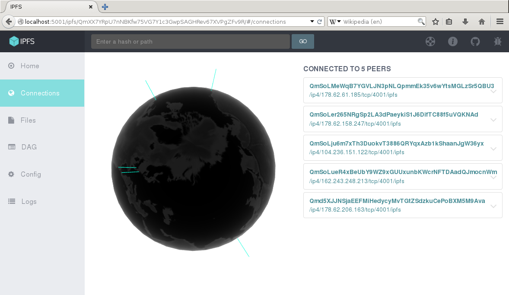

# 基本用法
如果尚未执行此操作，请[安装IPFS](https://docs.ipfs.io/introduction/install)。

在本教程中，如果您有任何疑问，请随时在https://discuss.ipfs.io/或chat.freenode.net上的#ipfs中询问。

## 初始化存储库
ipfs将所有设置和内部数据存储在名为存储库的目录中。在第一次使用IPFS之前，您需要使用以下ipfs init命令初始化存储库：
```sh
> ipfs init
initializing ipfs node at /Users/jbenet/.go-ipfs
generating 2048-bit RSA keypair...done
peer identity: Qmcpo2iLBikrdf1d6QU6vXuNb6P7hwrbNPW9kLAH8eG67z
to get started, enter:

  ipfs cat /ipfs/QmYwAPJzv5CZsnA625s3Xf2nemtYgPpHdWEz79ojWnPbdG/readme
```
1. 如果您在数据中心的服务器上运行，则应使用server配置文件初始化IPFS 。这将阻止IPFS在尝试发现本地节点时创建大量数据中心内部流量：
    ```sh
    > ipfs init --profile server
    ```
    您可能需要设置许多其他配置选项 - 请查看完整参考资料以获取更多信息。

2. 哈希后的peer identity: 是节点的ID，与上面输出中显示的不同。网络上的其他节点使用它来查找并连接到您。ipfs id如果需要，您可以随时运行以再次获取它。
3. 将HASH在ipfs cat /ipfs/HASH/readme上述行可以从不同HASH在你的输出。如果是，请使用您在以下说明中获得的那个。一定不要将这些哈希与您的对等身份哈希相混淆;比如 ipfs cat /ipfs/PEER_ID/readme这样不行。
现在，尝试运行：
```sh
ipfs cat /ipfs/QmYwAPJzv5CZsnA625s3Xf2nemtYgPpHdWEz79ojWnPbdG/readme
```
你应该看到这样的东西：
```sh
Hello and Welcome to IPFS!

██╗██████╗ ███████╗███████╗
██║██╔══██╗██╔════╝██╔════╝
██║██████╔╝█████╗  ███████╗
██║██╔═══╝ ██╔══╝  ╚════██║
██║██║     ██║     ███████║
╚═╝╚═╝     ╚═╝     ╚══════╝

If you're seeing this, you have successfully installed
IPFS and are now interfacing with the ipfs merkledag!

 -------------------------------------------------------
| Warning:                                              |
|   This is alpha software. use at your own discretion! |
|   Much is missing or lacking polish. There are bugs.  |
|   Not yet secure. Read the security notes for more.   |
 -------------------------------------------------------

Check out some of the other files in this directory:

  ./about
  ./help
  ./quick-start     <-- usage examples
  ./readme          <-- this file
  ./security-notes
```
你可以在那里探索其他物体。特别是，请查看quick-start：
```sh
ipfs cat /ipfs/QmYwAPJzv5CZsnA625s3Xf2nemtYgPpHdWEz79ojWnPbdG/quick-start
```
这将向您介绍几个有趣的例子。

## 连接其它ipfs
准备好在线处理后，在另一个终端中运行守护程序：
```sh
> ipfs daemon
Initializing daemon...
API server listening on /ip4/127.0.0.1/tcp/5001
Gateway server listening on /ip4/127.0.0.1/tcp/8080
```
等待所有三行出现。

`记下你得到的tcp端口。如果它们不同，请在以下命令中使用您的。`

现在，切换回原始终端。如果您已连接到网络，则在运行时应该能够看到对等方的ipfs地址：
```sh
> ipfs swarm peers
/ip4/104.131.131.82/tcp/4001/ipfs/QmaCpDMGvV2BGHeYERUEnRQAwe3N8SzbUtfsmvsqQLuvuJ
/ip4/104.236.151.122/tcp/4001/ipfs/QmSoLju6m7xTh3DuokvT3886QRYqxAzb1kShaanJgW36yx
/ip4/134.121.64.93/tcp/1035/ipfs/QmWHyrPWQnsz1wxHR219ooJDYTvxJPyZuDUPSDpdsAovN5
/ip4/178.62.8.190/tcp/4002/ipfs/QmdXzZ25cyzSF99csCQmmPZ1NTbWTe8qtKFaZKpZQPdTFB
```

这些是组合<transport address>/ipfs/<hash-of-public-key>。

现在，您应该能够从网络中获取对象。尝试：
```sh
ipfs cat /ipfs/QmW2WQi7j6c7UgJTarActp7tDNikE4B2qXtFCfLPdsgaTQ/cat.jpg >cat.jpg
open cat.jpg
```

而且，您应该能够提供网络对象。尝试添加一个，然后在您喜欢的浏览器中查看它。在此示例中，我们使用的curl 是浏览器，但您也可以在其他浏览器中打开IPFS URL：
```sh
> hash=`echo "I <3 IPFS -$(whoami)" | ipfs add -q`
> curl "https://ipfs.io/ipfs/$hash"
I <3 IPFS -<your username>
```
很酷，对吧？网关从您的计算机提供文件。网关查询DHT，找到您的机器，请求文件，您的机器将其发送到网关，然后网关将其发送到您的浏览器。

`注意：视网络状态而定，curl可能需要一段时间。公共网关可能超载或很难与您联系。`

您也可以在自己的本地网关上查看：
```sh
> curl "http://127.0.0.1:8080/ipfs/$hash"
I <3 IPFS -<your username>
```
默认情况下，您的网关不会向世界公开，它只在本地运行。

## web控制台
我们还有一个Web控制台，您可以使用它来检查节点的状态。在您喜欢的网络浏览器上，转到：

http://localhost:5001/webui

这应该会打开这样一个控制台：

Web控制台连接视图
现在，你准备好了：



[继续更多的例子](https://docs.ipfs.io/guides/examples/)